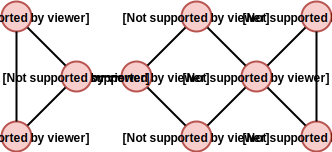

User can easily specify that some rooms should have different shapes than the others. It can be useful for example when you want to set a special rooms shape for your boss room or any other rooms with a special meaning.

## Setup
In this tutorial, we will use a graph with 9 vertices codenamed *Example2*:



We will use basic default shapes for rooms - a square and a rectangle - as they are not important for this tutorial.

## Adding custom shapes

In this tutorial, we imagine that the room with number 8 is a boss room. We don't want our boss room to look like any other room, right? Let's make it look special!

### Using C# api

```csharp
var mapDescription = new MapDescription<int>();

// Graph and default shapes are set here.

// Add boss room shape
var bossRoom = new RoomDescription(
  new GridPolygonBuilder()
    .AddPoint(2, 0).AddPoint(2, 1).AddPoint(1, 1).AddPoint(1, 2)
    .AddPoint(0, 2).AddPoint(0, 7).AddPoint(1, 7).AddPoint(1, 8)
    .AddPoint(2, 8).AddPoint(2, 9).AddPoint(7, 9).AddPoint(7, 8)
    .AddPoint(8, 8).AddPoint(8, 7).AddPoint(9, 7).AddPoint(9, 2)
    .AddPoint(8, 2).AddPoint(8, 1).AddPoint(7, 1).AddPoint(7, 0)
  .Build().Scale(new IntVector2(2, 2)),
  new OverlapMode(1, 1)
);

mapDescription.AddRoomShapes(8, bossRoom);
```

### Using config files

## Summary
The map description is now ready to be used in a layout generator. You can find the full C# source code [here TODO](TODO) and the config file [here TODO](TODO).

## Results

<div class="results">
  <a href="/MapGeneration/docs/assets/differentShapes/0.jpg" target="_blank">
    
  </a>
  <a href="/MapGeneration/docs/assets/differentShapes/1.jpg" target="_blank">
    
  </a>
  <a href="/MapGeneration/docs/assets/differentShapes/2.jpg" target="_blank">
    
  </a>
  <a href="/MapGeneration/docs/assets/differentShapes/3.jpg" target="_blank">
    
  </a>
</div>

**Note:** Click on images to see them in a full size.