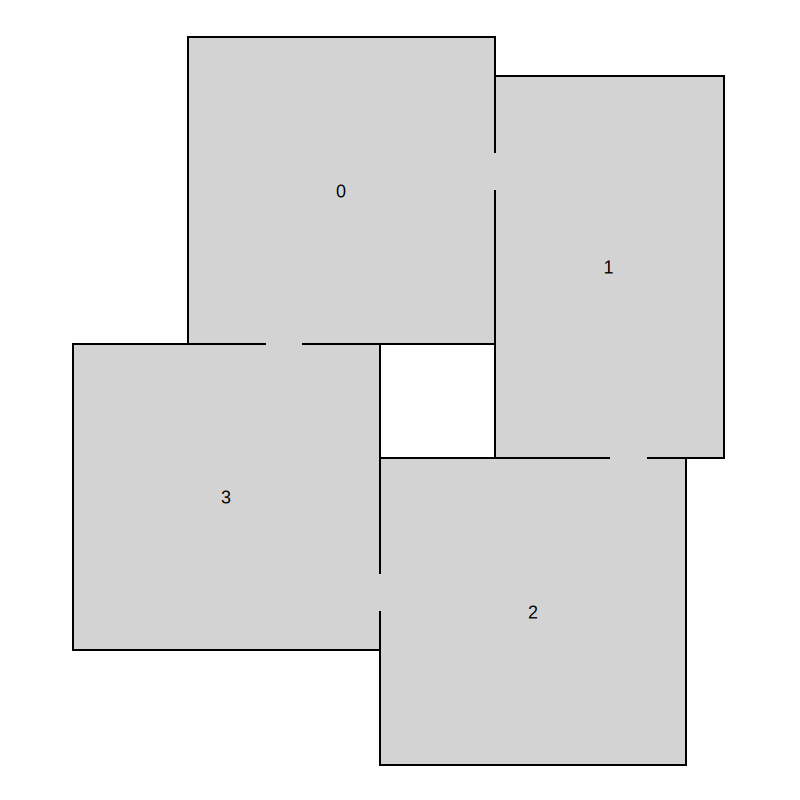

## Room templates

First, we will create our room templates. We must create an instance of `RoomTemplate` class for each room template. To do that, we need to create a *polygon* that defines the outline of the room template and also provide a list of possible door positions.

We will use the simple door mode with door length 1 and corner distance 1. That means that there are possible door positions on all outline tiles that are at least one tile away from the corners of the room template polygon.


```

var doorMode = new SimpleDoorModeGrid2D(doorLength: 1, cornerDistance: 1);


```

The first room template that we create is a simple square room with the door mode that we created previously. To create the outline polygon, we can use the `PolygonGrid2DBuilder` class which lets us easily add individual points of the polygon and then build the polygon from them.


```

var squareRoom = new RoomTemplateGrid2D(
    new PolygonGrid2DBuilder()
        .AddPoint(0, 0)
        .AddPoint(0, 8)
        .AddPoint(8, 8)
        .AddPoint(8, 0)
        .Build(),
    doorMode
);


```

The second room that we create is a simple rectangle room. If we deal mainly with squares and rectangles, we can use the `GetRectangle()` and `GetSquare()` helper methods.


```

var rectangleRoom = new RoomTemplateGrid2D(
    PolygonGrid2D.GetRectangle(6, 10),
    doorMode
);


```

## Room description


```

// Create room description
var basicRoomDescription = new RoomDescriptionGrid2D()
{
    IsCorridor = false,
    RoomTemplates = new List<RoomTemplateGrid2D>() { squareRoom, rectangleRoom }
};


```

## Level description


```

// Create map description
var levelDescription = new LevelDescriptionGrid2D<int>();

// Add rooms
levelDescription.AddRoom(0, basicRoomDescription);
levelDescription.AddRoom(1, basicRoomDescription);
levelDescription.AddRoom(2, basicRoomDescription);
levelDescription.AddRoom(3, basicRoomDescription);

// Add connections
levelDescription.AddConnection(0, 1);
levelDescription.AddConnection(0, 3);
levelDescription.AddConnection(1, 2);
levelDescription.AddConnection(2, 3);

// Add room shapes
return levelDescription;


```



