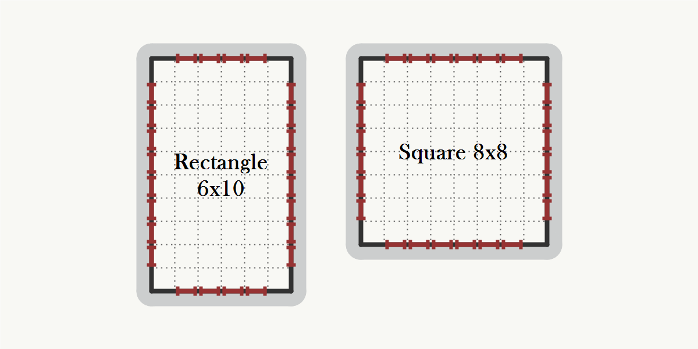

import { Gallery, GalleryImage } from "@theme/Gallery";

> The source code for this example can be found at the end of this page.

In this example, we will generate a very simple level consisting of 5 rooms with rectangular shapes.

## Room templates
First, we will create our room templates. We must create an instance of the `RoomTemplateGrid2D` class for each room template. To do that, we need to create a *polygon* that defines the outline of the room template and also provide a list of possible door positions.

### Outline
In the Grid 2D setting, the outline of a room template is an orthogonal polygon where each point has integer coordinates. In other words, it is a polygon that we can draw on an integer grid using 1x1 square tiles.

The first outline that we create is an 8x8 square:


```

var squareRoomOutline = new PolygonGrid2DBuilder()
    .AddPoint(0, 0)
    .AddPoint(0, 8)
    .AddPoint(8, 8)
    .AddPoint(8, 0)
    .Build();


```

> **Note:** Orthogonal (or rectilinear) polygon is a polygon of whose edge intersections are at right angles. When on an integer grid, each side of an orthogonal polygon is aligned with one of the axes.

> **Note:** There are several ways of constructing polygons:
   - `PolygonGrid2D.GetSquare(width)` for squares
   - `PolygonGrid2D.GetRectangle(width, height)` for rectangles
   - `PolygonGrid2DBuilder` with the `.AddPoint(x, y)` method
   - or the `PolygonGrid2D(IEnumerable<Vector2Int> points)` constructor

### Doors
`IDoorModeGrid2D` is an interface that specifies door positions of a given room template. The most simple *door mode* is the `SimpleDoorModeGrid2D` - it lets us specify the length of doors and how far from corners they must be. In this tutorial, we will use doors with length of 1 tile and at least 1 tile away from corners.


```

var doors = new SimpleDoorModeGrid2D(doorLength: 1, cornerDistance: 1);


```

> **Note:** There is also an additional door mode available - `ManualDoorModeGrid2D`. This mode lets you specify exactly which door positions are available. It is useful for example when we want to have doors only on the two opposite sides of a corridor.

### Allowed transformations
Optionally, it is also possible to let the algorithm apply some transformations to the room, e.g. rotate it by 90 degrees or mirror it by the X axis. The algorithm then also handles all the door positions automatically.


```

var transformations = new List<TransformationGrid2D>()
{
    TransformationGrid2D.Identity,
    TransformationGrid2D.Rotate90
};


```

### Putting it all together
We can now combine the *outline*, *door mode* and *allowed transformations* together to create our first room template.


```

var squareRoom = new RoomTemplateGrid2D(
    squareRoomOutline,
    doors,
    name: "Square 8x8",
    allowedTransformations: transformations
);


```

We can also create a room template in-place with a single expression.


```

var rectangleRoom = new RoomTemplateGrid2D(
    PolygonGrid2D.GetRectangle(6, 10),
    new SimpleDoorModeGrid2D(doorLength: 1, cornerDistance: 1),
    name: "Rectangle 6x10",
    allowedTransformations: new List<TransformationGrid2D>()
    {
        TransformationGrid2D.Identity,
        TransformationGrid2D.Rotate90
    }
);


```



## Room description
When we have our room templates ready, we need to create an instance of the `RoomDescriptionGrid2D` which describes the properties of individual rooms in the level. In this tutorial, all the rooms use the same pool of room templates, so we can create only a single room description and reuse it. However, it is also possible to use different room description for different types of rooms. For example, we may want to have a boss room and a spawn room that should use different room templates than other rooms.


```

var roomDescription = new RoomDescriptionGrid2D
(
    isCorridor: false,
    roomTemplates: new List<RoomTemplateGrid2D>() { squareRoom, rectangleRoom }
);


```

## Level description
The final step is to describe the structure of the level. First, we have to create an instance of the `LevelDescriptionGrid2D<TRoom>` class. For simplicity, We will use `integers` to identify individual rooms. But it is also possible to use a custom room type by using a different generic type parameter.


```

var levelDescription = new LevelDescriptionGrid2D<int>();


```

Next, we add individual rooms to the level description.


```

levelDescription.AddRoom(0, roomDescription);
levelDescription.AddRoom(1, roomDescription);
levelDescription.AddRoom(2, roomDescription);
levelDescription.AddRoom(3, roomDescription);
levelDescription.AddRoom(4, roomDescription);


```

And lastly, we describe how should individual rooms be connected.


```

levelDescription.AddConnection(0, 1);
levelDescription.AddConnection(0, 3);
levelDescription.AddConnection(0, 4);
levelDescription.AddConnection(1, 2);
levelDescription.AddConnection(2, 3);


```

The graph that we created can be seen below:


## Generating the level
To generate the level, we need to create an instance of the `GraphBasedGenerator<TRoom>` class. As we use integers to identify individual rooms, we will substitute the generic type parameter with `int` and pass the level description to the constructor of the generator.


```

var generator = new GraphBasedGeneratorGrid2D<int>(levelDescription);


```

When we have an instance of the generator, we simply call the `GenerateLayout()` method and wait until the generator finds a valid layout based on our level description.


```

var layout = generator.GenerateLayout();


```

The result contains information about all the rooms in the level such as outline of a room or its position.

## Saving the result
If we want to quickly visualize the result, we can use the `DungeonDrawer<TRoom>` class and export the layout as PNG.


```

var drawer = new DungeonDrawer<int>();
drawer.DrawLayoutAndSave(layout, "basics.png", new DungeonDrawerOptions()
{
    Width = 1000,
    Height = 1000,
});


```


## Results

Below you can see some of the results generated from this example:


<Gallery cols={2}>
<GalleryImage withoutLinks src={require('!!url-loader!./basics/0_0.png').default} />
<GalleryImage withoutLinks src={require('!!url-loader!./basics/0_1.png').default} />
<GalleryImage withoutLinks src={require('!!url-loader!./basics/0_2.png').default} />
<GalleryImage withoutLinks src={require('!!url-loader!./basics/0_3.png').default} />
</Gallery>

## Source code

```
using System.Collections.Generic;
using System.Linq;
using Edgar.Geometry;
using Edgar.GraphBasedGenerator.Grid2D;
using Edgar.GraphBasedGenerator.Grid2D.Drawing;

namespace Examples
{
    public class BasicsExample 
    {
        /// <summary>
        /// Prepare level description.
        /// </summary>
        public LevelDescriptionGrid2D<int> GetLevelDescription()
        {
            var squareRoomOutline = new PolygonGrid2DBuilder()
                .AddPoint(0, 0)
                .AddPoint(0, 8)
                .AddPoint(8, 8)
                .AddPoint(8, 0)
                .Build();
            
            var doors = new SimpleDoorModeGrid2D(doorLength: 1, cornerDistance: 1);

            var transformations = new List<TransformationGrid2D>()
            {
                TransformationGrid2D.Identity,
                TransformationGrid2D.Rotate90
            };

            var squareRoom = new RoomTemplateGrid2D(
                squareRoomOutline,
                doors,
                name: "Square 8x8",
                allowedTransformations: transformations
            );

            var rectangleRoom = new RoomTemplateGrid2D(
                PolygonGrid2D.GetRectangle(6, 10),
                new SimpleDoorModeGrid2D(doorLength: 1, cornerDistance: 1),
                name: "Rectangle 6x10",
                allowedTransformations: new List<TransformationGrid2D>()
                {
                    TransformationGrid2D.Identity,
                    TransformationGrid2D.Rotate90
                }
            );

            var roomDescription = new RoomDescriptionGrid2D
            (
                isCorridor: false,
                roomTemplates: new List<RoomTemplateGrid2D>() { squareRoom, rectangleRoom }
            );
            
            var levelDescription = new LevelDescriptionGrid2D<int>();

            levelDescription.AddRoom(0, roomDescription);
            levelDescription.AddRoom(1, roomDescription);
            levelDescription.AddRoom(2, roomDescription);
            levelDescription.AddRoom(3, roomDescription);
            levelDescription.AddRoom(4, roomDescription);

            levelDescription.AddConnection(0, 1);
            levelDescription.AddConnection(0, 3);
            levelDescription.AddConnection(0, 4);
            levelDescription.AddConnection(1, 2);
            levelDescription.AddConnection(2, 3);

            return levelDescription;
        }

        /// <summary>
        /// Run the generator.
        /// </summary>
        public void Run()
        {
            var levelDescription = GetLevelDescription();
            var generator = new GraphBasedGeneratorGrid2D<int>(levelDescription);

            var layout = generator.GenerateLayout();

            var drawer = new DungeonDrawer<int>();
            drawer.DrawLayoutAndSave(layout, "basics.png", new DungeonDrawerOptions()
            {
                Width = 1000,
                Height = 1000,
            });
        }
    }
}
```

