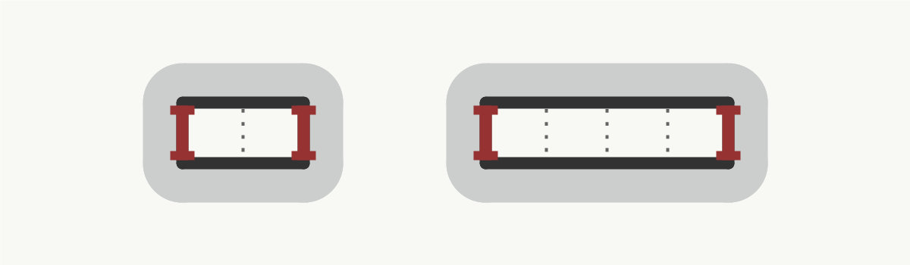

import { Gallery, GalleryImage } from "@theme/Gallery";

> The source code for this example can be found at the end of this page.

## Corridor room description
First, we create the outline for the corridor room template. As the performance of the generator is the best with rather short corridors, we will use a 3x1 rectangle:


```

var corridorOutline = PolygonGrid2D.GetRectangle(3, 1);


```

The next step is to add doors. We can no longer use the simple door mode because we want to have exactly two door positions on the opposite sides of the corridor, which is not possible with the simple mode. With the manual mode, we have to specify all the door positions manually.


```

var corridorDoors = new ManualDoorModeGrid2D(new List<DoorGrid2D>()
    {
        new DoorGrid2D(new Vector2Int(0, 0), new Vector2Int(0, 1)),
        new DoorGrid2D(new Vector2Int(3, 0), new Vector2Int(3, 1))
    }
);


```

Now we can create the corridor room template. We must not forget to allow the 90 degrees rotation because, otherwise we would not be able to connect rooms both vertically and horizontally.


```

var corridorRoomTemplate = new RoomTemplateGrid2D(
    corridorOutline,
    corridorDoors,
    allowedTransformations: new List<TransformationGrid2D>()
    {
        TransformationGrid2D.Identity,
        TransformationGrid2D.Rotate90
    }
);


```



And finally, we can create the corridor room description. We must not forget to set the `IsCorridor` flag to `true`.


```

var corridorRoomDescription = new RoomDescriptionGrid2D
(
    isCorridor: true,
    roomTemplates: new List<RoomTemplateGrid2D>() {corridorRoomTemplate}
);


```

## Basic room description
For non-corridor rooms, we will use two rectangular room templates - 8x8 square and 6x10 rectangle. The full code is omitted for simplicity.


```

var basicRoomDescription = GetBasicRoomDescription();


```

## Level description
To simplify this tutorial, we will use a graph of rooms from our graph database:


```

var levelDescription = new LevelDescriptionGrid2D<int>();
var graph = GraphsDatabase.GetExample5();


```

First, we add non-corridor rooms:


```

foreach (var room in graph.Vertices)
{
    levelDescription.AddRoom(room, basicRoomDescription);
}


```

We have to somehow identify corridor rooms. As we use integers, probably the easiest way is to number them and keep track which was the last used number:


```

var corridorCounter = graph.VerticesCount;


```

Now we can add corridor rooms. For each edge of the original graph, we create a corridor room and connect it to the two non-corridor rooms:


```

foreach (var connection in graph.Edges)
{
    // We manually insert a new room between each neighboring rooms in the graph
    levelDescription.AddRoom(corridorCounter, corridorRoomDescription);

    // And instead of connecting the rooms directly, we connect them to the corridor room
    levelDescription.AddConnection(connection.From, corridorCounter);
    levelDescription.AddConnection(connection.To, corridorCounter);

    corridorCounter++;
}


```

## Results

Below you can see some of the results generated from this example:


<Gallery cols={2}>
<GalleryImage src={require('./corridors/0_0.png').default} />
<GalleryImage src={require('./corridors/0_1.png').default} />
<GalleryImage src={require('./corridors/0_2.png').default} />
<GalleryImage src={require('./corridors/0_3.png').default} />
</Gallery>

## Source code

```
using System.Collections.Generic;
using System.Linq;
using Edgar.Geometry;
using Edgar.GraphBasedGenerator.Grid2D;
using Edgar.GraphBasedGenerator.Grid2D.Drawing;
using Edgar.Legacy.Utils;

namespace Examples
{
    public class CorridorsExample 
    {
        public LevelDescriptionGrid2D<int> GetLevelDescription()
        {
            var corridorOutline = PolygonGrid2D.GetRectangle(3, 1);

            var corridorDoors = new ManualDoorModeGrid2D(new List<DoorGrid2D>()
                {
                    new DoorGrid2D(new Vector2Int(0, 0), new Vector2Int(0, 1)),
                    new DoorGrid2D(new Vector2Int(3, 0), new Vector2Int(3, 1))
                }
            );

            var corridorRoomTemplate = new RoomTemplateGrid2D(
                corridorOutline,
                corridorDoors,
                allowedTransformations: new List<TransformationGrid2D>()
                {
                    TransformationGrid2D.Identity,
                    TransformationGrid2D.Rotate90
                }
            );

            var corridorRoomDescription = new RoomDescriptionGrid2D
            (
                isCorridor: true,
                roomTemplates: new List<RoomTemplateGrid2D>() {corridorRoomTemplate}
            );

            var basicRoomDescription = GetBasicRoomDescription();

            var levelDescription = new LevelDescriptionGrid2D<int>();
            var graph = GraphsDatabase.GetExample5();

            foreach (var room in graph.Vertices)
            {
                levelDescription.AddRoom(room, basicRoomDescription);
            }

            var corridorCounter = graph.VerticesCount;

            foreach (var connection in graph.Edges)
            {
                // We manually insert a new room between each neighboring rooms in the graph
                levelDescription.AddRoom(corridorCounter, corridorRoomDescription);

                // And instead of connecting the rooms directly, we connect them to the corridor room
                levelDescription.AddConnection(connection.From, corridorCounter);
                levelDescription.AddConnection(connection.To, corridorCounter);

                corridorCounter++;
            }

            return levelDescription;
        }

        public void Run()
        {
            var levelDescription = GetLevelDescription();
            var generator = new GraphBasedGeneratorGrid2D<int>(levelDescription);
            var layout = generator.GenerateLayout();

            var drawer = new DungeonDrawer<int>();
            var bitmap = drawer.DrawLayout(layout, new DungeonDrawerOptions()
            {
                Width = 1000,
                Height = 1000,
            });
            bitmap.Save("corridors.png");
        }

        private RoomDescriptionGrid2D GetBasicRoomDescription()
        {
            var doors = new SimpleDoorModeGrid2D(doorLength: 1, cornerDistance: 1);
            var transformations = new List<TransformationGrid2D>()
            {
                TransformationGrid2D.Identity,
                TransformationGrid2D.Rotate90
            };

            var squareRoom = new RoomTemplateGrid2D(
                PolygonGrid2D.GetSquare(8),
                doors,
                name: "Square 8x8",
                allowedTransformations: transformations
            );

            var rectangleRoom = new RoomTemplateGrid2D(
                PolygonGrid2D.GetRectangle(6, 10),
                doors,
                name: "Rectangle 6x10",
                allowedTransformations: transformations
            );

            return new RoomDescriptionGrid2D
            (
                isCorridor: false,
                roomTemplates: new List<RoomTemplateGrid2D>() {            
                    squareRoom,
                    rectangleRoom
                }
            );
        }
    }
}
```

