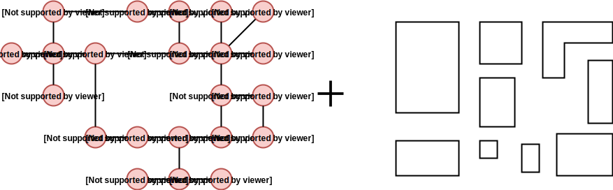

This project is a library for procedural generation of 2D layouts based on a graph of rooms connections.

To produce a game level, the algorithm takes a set of polygonal building blocks and a level connectivity graph (the level topology) as an input. Nodes in the graph represent rooms, and edges define connectivities between them. The graph has to be planar. The goal of the algorithm is to assign a room shape and a position to each node in the graph in a way that no two room shapes intersect and every pair of neighbouring room shapes can be connected by doors.

See the [Guides](guides.md) section to learn how to use the application and the [Chain based generator](chainBasedGenerator.md) section if you want to find out how it all works or plan to extend the generator.

## Features
- Any planar connected graph can be used as an input
- Any orthogonal polygon can be used as a room shape
- Complete control over shapes of individual rooms
- Complete control over door positions of individual room shapes
- Rooms either directly connected by doors or connected by corridors
- Export to JSON, SVG, JPG
- Majority of features available through a GUI and YAML config files
- Implicit support for keys and locks - just define the connectivity graph hovewer you like

## Inspiration
The main idea of the algorithm used in this library comes from a [paper](http://chongyangma.com/publications/gl/index.html) written by **Chongyang Ma** and colleagues so be sure to check their work out.

Some things in this library are done differently and/or improved:
- **Integer coordinates** are used instead of reals - room shapes are therefore only orthogonal polygons.
- With integer coordinates, **optimized polygon operations** (intersections, etc..) were implemented with a complete control over the process.
- User has a complete control over door positions of rooms.
- The algorithm was optimized to generate a layout as fast as possible.
- A specialized version of the generator was implemented to support **adding (usally) short corridors** between rooms to the layout without sacrificing most of the convergence speed. (Average number of iterations usually stays the same but iterations themselves are slower.)

## Examples

### Input

### Results

  
  
  
  

**Note:** Click on images to see them in a full size.