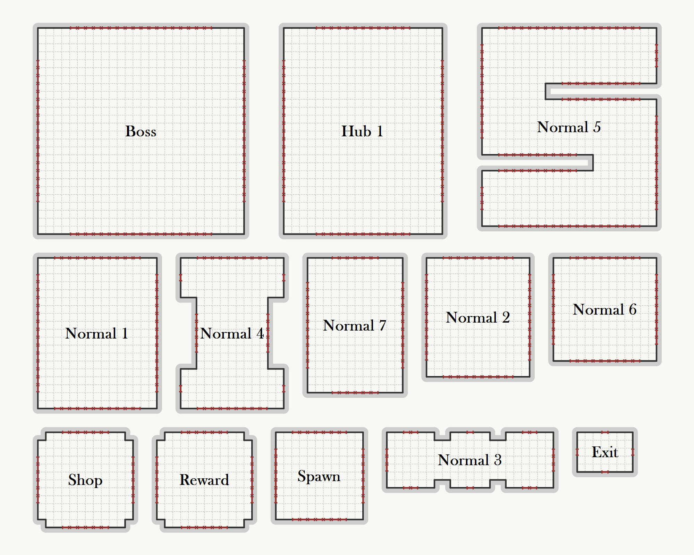
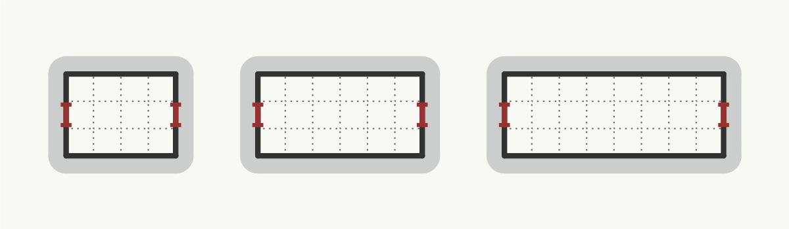

import { Gallery, GalleryImage } from "@theme/Gallery";


In this example, we will create a level description that should be close to what we could use in a game. We will cover the following:
- create a `RoomType` enum for individual types of rooms - spawn, boss, shop, reward, etc.
- create a custom `Room` class to identify rooms in the level graph
- assign room templates based on the type of the room
- use corridors with different lengths

## Room type
To distinguish between different types of rooms, we create a `RoomType` enum. We will use to when deciding which room templates should be assigned to individual rooms. *Normal* rooms are basic combat-oriented rooms, *Hub* rooms are rather large rooms which we can use when a room has many neighbors, and the meaning of the rest of room types should be obvious.


```

#endregion

/// <summary>
/// Custom room type that we will use when choosing room templates for a given room.
/// </summary>
public enum RoomType
{
    Normal, Hub, Spawn, Boss, Corridor, Exit, Reward, Shop, 
}


```


## Room class
In the previous examples, we used integers to identify individual rooms. We could theoretically still use integers and have a mapping from these integers to room types, but there exists a better way. We can implement a custom room class which will hold the room type. And if we also override the `ToString()` method, we will get the name of each room written over the room when we export the level.


```

/// <summary>
/// Custom room class that holds the name and the type of a room.
/// </summary>
public class Room
{
    public string Name { get; }

    public RoomType Type { get; }

    public Room(string name, RoomType type)
    {
        Type = type;
        Name = name;
    }

    public override string ToString()
    {
        return Name;
    }
}


```


## Room templates
The next step is to create room templates. We will create a mapping from the name of a room template to the instance of that room template so that we can refer to that instance later. We create at least a single room template for each room type.


```

/// <summary>
/// Gets all available room templates for non-corridor rooms.
/// </summary>
/// <returns></returns>
private Dictionary<string, RoomTemplateGrid2D> GetRoomTemplates()
{
    return new List<RoomTemplateGrid2D>()
    {
        new RoomTemplateGrid2D(
            PolygonGrid2D.GetRectangle(15, 19),
            new SimpleDoorModeGrid2D(1, 2),
            allowedTransformations: TransformationGrid2DHelper.GetRotations(),
            name: "Normal 1"
        ),
        new RoomTemplateGrid2D(
            PolygonGrid2D.GetRectangle(13, 15),
            new SimpleDoorModeGrid2D(1, 2),
            allowedTransformations: TransformationGrid2DHelper.GetRotations(),
            name: "Normal 2"
        ),
        new RoomTemplateGrid2D(
            new PolygonGrid2DBuilder()
                .AddPoint(-11, 6).AddPoint(-5, 6).AddPoint(-5, 5).AddPoint(-3, 5)
                .AddPoint(-3, 6).AddPoint(2, 6).AddPoint(2, 5).AddPoint(4, 5)
                .AddPoint(4, 6).AddPoint(10, 6).AddPoint(10, -1).AddPoint(4, -1)
                .AddPoint(4, 0).AddPoint(2, 0).AddPoint(2, -1).AddPoint(-3, -1)
                .AddPoint(-3, 0).AddPoint(-5, 0).AddPoint(-5, -1).AddPoint(-11, -1)
                .Build(),
            new SimpleDoorModeGrid2D(1, 2),
            // repeatMode: RoomTemplateRepeatMode.NoRepeat,
            allowedTransformations: TransformationGrid2DHelper.GetRotations(),
            name: "Normal 3"
        ),

        /* Other room templates */

    }.ToDictionary(x => x.Name, x => x);
}


```


Below we can see a visualization of all the room templates:



The last thing we have to do is to create a mapping from `RoomType` to its room templates.


```

/// <summary>
/// Gets room templates for a given room based on its type.
/// </summary>
private List<RoomTemplateGrid2D> GetRoomTemplatesForRoom(Room room, Dictionary<string, RoomTemplateGrid2D> roomTemplates)
{
    switch (room.Type)
    {
        case RoomType.Spawn:
            return new List<RoomTemplateGrid2D>()
            {
                roomTemplates["Spawn"],
            };

        case RoomType.Normal:
            return new List<RoomTemplateGrid2D>()
            {
                roomTemplates["Normal 1"],
                roomTemplates["Normal 2"],
                roomTemplates["Normal 3"],
                roomTemplates["Normal 4"],
                roomTemplates["Normal 5"],
                roomTemplates["Normal 6"],
                roomTemplates["Normal 7"],
            };


        /* Handle other room types */

    }
}


```


## Corridor room templates
We will use corridors of 3 different sizes:



## Graph of rooms

First, we create a list of all the rooms.


```

var rooms = new List<Room>
{
    new Room("Spawn", RoomType.Spawn),
    new Room("Normal 1", RoomType.Normal),
    new Room("Normal 2", RoomType.Normal),
    new Room("Normal 3", RoomType.Normal),
    new Room("Normal 4", RoomType.Normal),
    new Room("Boss", RoomType.Boss),
    new Room("Exit", RoomType.Exit),

    new Room("Normal 5", RoomType.Normal),
    new Room("Shop 1", RoomType.Shop),
    new Room("Normal 6", RoomType.Normal),
    new Room("Reward 1", RoomType.Reward),

    new Room("Hub 1", RoomType.Hub),
    new Room("Reward 2", RoomType.Reward),
    new Room("Normal 7", RoomType.Normal),
    new Room("Normal 8", RoomType.Normal),
};


```

We also create a mapping from the name of the room to the instance of the room so we can refer to the rooms later by their names.


```

var nameToRoomMapping = rooms.ToDictionary(x => x.Name, x => x);


```

Now we can add all the rooms to the graph.


```

var graph = new UndirectedAdjacencyListGraph<Room>();

foreach (var room in rooms)
{
    graph.AddVertex(room);
}


```

In the previous examples, we created rather random graphs that would probably not make sense in a real video game. We will now attempt to create a more reasonable graph.

First, we create the main path from the spawn room to the boss room.


```

// Main path to boss room
graph.AddEdge(nameToRoomMapping["Spawn"], nameToRoomMapping["Normal 1"]);
graph.AddEdge(nameToRoomMapping["Normal 1"], nameToRoomMapping["Normal 2"]);
graph.AddEdge(nameToRoomMapping["Normal 2"], nameToRoomMapping["Normal 3"]);
graph.AddEdge(nameToRoomMapping["Normal 3"], nameToRoomMapping["Normal 4"]);
graph.AddEdge(nameToRoomMapping["Normal 4"], nameToRoomMapping["Boss"]);
graph.AddEdge(nameToRoomMapping["Boss"], nameToRoomMapping["Exit"]);


```

Then we create a loop that contains a shop and a reward room.


```

// Branch 1
graph.AddEdge(nameToRoomMapping["Normal 2"], nameToRoomMapping["Normal 5"]);
graph.AddEdge(nameToRoomMapping["Normal 5"], nameToRoomMapping["Shop 1"]);
graph.AddEdge(nameToRoomMapping["Shop 1"], nameToRoomMapping["Normal 6"]);
graph.AddEdge(nameToRoomMapping["Normal 6"], nameToRoomMapping["Reward 1"]);
graph.AddEdge(nameToRoomMapping["Reward 1"], nameToRoomMapping["Normal 5"]);


```

And finally we create a loop that contains another reward room.


```

// Branch 2
graph.AddEdge(nameToRoomMapping["Normal 3"], nameToRoomMapping["Hub 1"]);
graph.AddEdge(nameToRoomMapping["Hub 1"], nameToRoomMapping["Reward 2"]);
graph.AddEdge(nameToRoomMapping["Reward 2"], nameToRoomMapping["Normal 7"]);
graph.AddEdge(nameToRoomMapping["Normal 7"], nameToRoomMapping["Normal 8"]);
graph.AddEdge(nameToRoomMapping["Normal 8"], nameToRoomMapping["Hub 1"]);


```


## Level description
Now we are ready to create the level description.


```

var levelDescription = new LevelDescriptionGrid2D<Room>
{
    MinimumRoomDistance = 2,
};


```

First, we get the graph and room templates.


```

var graph = GetGraph();
var roomTemplates = GetRoomTemplates();


```

Next, we add all the non-corridor rooms. For each room, we get room templates based on the type of the room.


```

foreach (var room in graph.Vertices)
{
    levelDescription.AddRoom(room, new RoomDescriptionGrid2D
    (
        isCorridor: false,
        roomTemplates: GetRoomTemplatesForRoom(room, roomTemplates)
    ));
}


```

Then we prepare a corridor room description. All corridors use the same room templates so we can reuse the instance of the room description for all corridors.


```

var corridorRoomDescription = new RoomDescriptionGrid2D
(
    isCorridor: true,
    roomTemplates: GetCorridorRoomTemplates()
);


```

And the final step is to add all the connections.


```

foreach (var edge in graph.Edges)
{
    var corridorRoom = new Room("Corridor", RoomType.Corridor);

    levelDescription.AddRoom(corridorRoom, corridorRoomDescription);
    levelDescription.AddConnection(edge.From, corridorRoom);
    levelDescription.AddConnection(edge.To, corridorRoom);
}


```

## Results

Below you can see some of the results generated from this example:


<Gallery cols={2}>
<GalleryImage src={require('./complex-dungeon/0_0.png').default} />
<GalleryImage src={require('./complex-dungeon/0_1.png').default} />
<GalleryImage src={require('./complex-dungeon/0_2.png').default} />
<GalleryImage src={require('./complex-dungeon/0_3.png').default} />
</Gallery>

<div style={{ textAlign: 'center', marginTop: '-15px' }}>

*Average time to generate the level: 0.15s (0.08s init, 0.07s generation itself)*

</div>

## Source code

```
using System;
using System.Collections.Generic;
using System.Linq;
using Edgar.Geometry;
using Edgar.GraphBasedGenerator.Grid2D;
using Edgar.GraphBasedGenerator.Grid2D.Drawing;
using Edgar.Graphs;

namespace Examples
{
    public class ComplexDungeonExample 
    {
        /// <summary>
        /// Prepare level description.
        /// </summary>
        public LevelDescriptionGrid2D<Room> GetLevelDescription() 
        {
            var levelDescription = new LevelDescriptionGrid2D<Room>
            {
                MinimumRoomDistance = 2,
            };

            var graph = GetGraph();
            var roomTemplates = GetRoomTemplates();

            foreach (var room in graph.Vertices)
            {
                levelDescription.AddRoom(room, new RoomDescriptionGrid2D
                (
                    isCorridor: false,
                    roomTemplates: GetRoomTemplatesForRoom(room, roomTemplates)
                ));
            }

            var corridorRoomDescription = new RoomDescriptionGrid2D
            (
                isCorridor: true,
                roomTemplates: GetCorridorRoomTemplates()
            );

            foreach (var edge in graph.Edges)
            {
                var corridorRoom = new Room("Corridor", RoomType.Corridor);

                levelDescription.AddRoom(corridorRoom, corridorRoomDescription);
                levelDescription.AddConnection(edge.From, corridorRoom);
                levelDescription.AddConnection(edge.To, corridorRoom);
            }

            return levelDescription;
        }

        /// <summary>
        /// Run the generator.
        /// </summary>
        public void Run()
        {
            var levelDescription = GetLevelDescription();

            var generator = new GraphBasedGeneratorGrid2D<Room>(levelDescription);
            var layout = generator.GenerateLayout();

            var drawer = new DungeonDrawer<Room>();
            drawer.DrawLayoutAndSave(layout, "basics.png", new DungeonDrawerOptions()
            {
                Width = 1000,
                Height = 1000,
            });
        }

        /// <summary>
        /// Gets room templates for a given room based on its type.
        /// </summary>
        private List<RoomTemplateGrid2D> GetRoomTemplatesForRoom(Room room, Dictionary<string, RoomTemplateGrid2D> roomTemplates)
        {
            switch (room.Type)
            {
                case RoomType.Spawn:
                    return new List<RoomTemplateGrid2D>()
                    {
                        roomTemplates["Spawn"],
                    };

                case RoomType.Normal:
                    return new List<RoomTemplateGrid2D>()
                    {
                        roomTemplates["Normal 1"],
                        roomTemplates["Normal 2"],
                        roomTemplates["Normal 3"],
                        roomTemplates["Normal 4"],
                        roomTemplates["Normal 5"],
                        roomTemplates["Normal 6"],
                        roomTemplates["Normal 7"],
                    };

                #region hidden:Handle other room types

                case RoomType.Boss:
                    return new List<RoomTemplateGrid2D>()
                    {
                        roomTemplates["Boss"],
                    };

                case RoomType.Exit:
                    return new List<RoomTemplateGrid2D>()
                    {
                        roomTemplates["Exit"],
                    };

                case RoomType.Reward:
                    return new List<RoomTemplateGrid2D>()
                    {
                        roomTemplates["Reward"],
                    };

                case RoomType.Shop:
                    return new List<RoomTemplateGrid2D>()
                    {
                        roomTemplates["Shop"],
                    };

                case RoomType.Hub:
                    return new List<RoomTemplateGrid2D>()
                    {
                        roomTemplates["Hub 1"],
                    };

                default:
                    throw new ArgumentOutOfRangeException(nameof(room.Type), room.Type, null);

                #endregion
            }
        }

        /// <summary>
        /// Gets all available room templates for non-corridor rooms.
        /// </summary>
        /// <returns></returns>
        private Dictionary<string, RoomTemplateGrid2D> GetRoomTemplates()
        {
            return new List<RoomTemplateGrid2D>()
            {
                new RoomTemplateGrid2D(
                    PolygonGrid2D.GetRectangle(15, 19),
                    new SimpleDoorModeGrid2D(1, 2),
                    allowedTransformations: TransformationGrid2DHelper.GetRotations(),
                    name: "Normal 1"
                ),
                new RoomTemplateGrid2D(
                    PolygonGrid2D.GetRectangle(13, 15),
                    new SimpleDoorModeGrid2D(1, 2),
                    allowedTransformations: TransformationGrid2DHelper.GetRotations(),
                    name: "Normal 2"
                ),
                new RoomTemplateGrid2D(
                    new PolygonGrid2DBuilder()
                        .AddPoint(-11, 6).AddPoint(-5, 6).AddPoint(-5, 5).AddPoint(-3, 5)
                        .AddPoint(-3, 6).AddPoint(2, 6).AddPoint(2, 5).AddPoint(4, 5)
                        .AddPoint(4, 6).AddPoint(10, 6).AddPoint(10, -1).AddPoint(4, -1)
                        .AddPoint(4, 0).AddPoint(2, 0).AddPoint(2, -1).AddPoint(-3, -1)
                        .AddPoint(-3, 0).AddPoint(-5, 0).AddPoint(-5, -1).AddPoint(-11, -1)
                        .Build(),
                    new SimpleDoorModeGrid2D(1, 2),
                    // repeatMode: RoomTemplateRepeatMode.NoRepeat,
                    allowedTransformations: TransformationGrid2DHelper.GetRotations(),
                    name: "Normal 3"
                ),
                #region hidden:Other room templates
                new RoomTemplateGrid2D(
                    new PolygonGrid2DBuilder()
                        .AddPoint(-39, 1).AddPoint(-37, 1).AddPoint(-37, 10).AddPoint(-39, 10)
                        .AddPoint(-39, 15).AddPoint(-26, 15).AddPoint(-26, 10).AddPoint(-28, 10)
                        .AddPoint(-28, 1).AddPoint(-26, 1).AddPoint(-26, -4).AddPoint(-39, -4)
                        .Build(),
                    new SimpleDoorModeGrid2D(1, 2),
                    allowedTransformations: TransformationGrid2DHelper.GetRotations(),
                    name: "Normal 4"
                ),
                new RoomTemplateGrid2D(
                    new PolygonGrid2DBuilder()
                        .AddPoint(-14, 3).AddPoint(0, 3).AddPoint(0, 5).AddPoint(-14, 5)
                        .AddPoint(-14, 12).AddPoint(8, 12).AddPoint(8, -4).AddPoint(-6, -4)
                        .AddPoint(-6, -6).AddPoint(8, -6).AddPoint(8, -13).AddPoint(-14, -13)
                        .Build(),
                    new SimpleDoorModeGrid2D(1, 2),
                    // repeatMode: RoomTemplateRepeatMode.NoRepeat,
                    name: "Normal 5"
                ),
                new RoomTemplateGrid2D(
                    PolygonGrid2D.GetSquare(13), 
                    new SimpleDoorModeGrid2D(1, 2),
                    name: "Normal 6"
                ),
                new RoomTemplateGrid2D(
                    PolygonGrid2D.GetSquare(11), 
                    new SimpleDoorModeGrid2D(1, 2),
                    name: "Spawn"
                ),
                new RoomTemplateGrid2D(
                    PolygonGrid2D.GetRectangle(26, 26),
                    new SimpleDoorModeGrid2D(1, 4),
                    allowedTransformations: TransformationGrid2DHelper.GetRotations(),
                    name: "Boss"
                ),
                new RoomTemplateGrid2D(PolygonGrid2D.GetRectangle(20, 26), 
                    new SimpleDoorModeGrid2D(1, 4),
                    allowedTransformations: TransformationGrid2DHelper.GetRotations(),
                    name: "Hub 1"
                ),
                new RoomTemplateGrid2D(
                    new PolygonGrid2DBuilder()
                        .AddPoint(-8, 7).AddPoint(-7, 7).AddPoint(-7, 8).AddPoint(3, 8)
                        .AddPoint(3, 7).AddPoint(4, 7).AddPoint(4, -3).AddPoint(3, -3)
                        .AddPoint(3, -4).AddPoint(-7, -4).AddPoint(-7, -3).AddPoint(-8, -3)
                        .Build(),
                    new SimpleDoorModeGrid2D(1, 2),
                    name: "Reward"
                ),
                new RoomTemplateGrid2D(
                    PolygonGrid2D.GetRectangle(12, 17), 
                    new SimpleDoorModeGrid2D(1, 3),
                    allowedTransformations: TransformationGrid2DHelper.GetRotations(),
                    name: "Normal 7"
                ),
                new RoomTemplateGrid2D(
                    new PolygonGrid2DBuilder()
                        .AddPoint(-3, 4).AddPoint(4, 4).AddPoint(4, -1).AddPoint(-3, -1)
                        .Build(),
                    new ManualDoorModeGrid2D(new List<DoorGrid2D>()
                        {
                        new DoorGrid2D(new Vector2Int(4, 2), new Vector2Int(4, 1)),
                        new DoorGrid2D(new Vector2Int(-3, 2), new Vector2Int(-3, 1)),
                        new DoorGrid2D(new Vector2Int(0, 4), new Vector2Int(1, 4)),
                        new DoorGrid2D(new Vector2Int(0, -1), new Vector2Int(1, -1)),
                        }
                    ),
                    name: "Exit"
                ),
                new RoomTemplateGrid2D(
                    new PolygonGrid2DBuilder()
                        .AddPoint(-8, 7).AddPoint(-7, 7).AddPoint(-7, 8).AddPoint(3, 8)
                        .AddPoint(3, 7).AddPoint(4, 7).AddPoint(4, -3).AddPoint(3, -3)
                        .AddPoint(3, -4).AddPoint(-7, -4).AddPoint(-7, -3).AddPoint(-8, -3)
                        .Build(),
                    new SimpleDoorModeGrid2D(1, 2),
                    name: "Shop"
                ),
                new RoomTemplateGrid2D(
                    PolygonGrid2D.GetSquare(9), 
                    new SimpleDoorModeGrid2D(1, 2),
                    name: "Secret"
                )
                #endregion
            }.ToDictionary(x => x.Name, x => x);
        }

        /// <summary>
        /// Gets all available room templates for corridor rooms.
        /// </summary>
        private List<RoomTemplateGrid2D> GetCorridorRoomTemplates()
        {
            return new List<RoomTemplateGrid2D>()
            {
                new RoomTemplateGrid2D(
                    PolygonGrid2D.GetRectangle(4, 3),
                    new ManualDoorModeGrid2D(new List<DoorGrid2D>()
                        {
                            new DoorGrid2D(new Vector2Int(0, 1), new Vector2Int(0, 2)),
                            new DoorGrid2D(new Vector2Int(4, 1), new Vector2Int(4, 2)),
                        }
                    ),
                    allowedTransformations: TransformationGrid2DHelper.GetRotations()
                ),
                new RoomTemplateGrid2D(
                    PolygonGrid2D.GetRectangle(6, 3),
                    new ManualDoorModeGrid2D(new List<DoorGrid2D>()
                        {
                            new DoorGrid2D(new Vector2Int(0, 1), new Vector2Int(0, 2)),
                            new DoorGrid2D(new Vector2Int(6, 1), new Vector2Int(6, 2)),
                        }
                    ),
                    allowedTransformations: TransformationGrid2DHelper.GetRotations()
                ),
                new RoomTemplateGrid2D(
                    PolygonGrid2D.GetRectangle(8, 3),
                    new ManualDoorModeGrid2D(new List<DoorGrid2D>()
                        {
                            new DoorGrid2D(new Vector2Int(0, 1), new Vector2Int(0, 2)),
                            new DoorGrid2D(new Vector2Int(8, 1), new Vector2Int(8, 2)),
                        }
                    ),
                    allowedTransformations: TransformationGrid2DHelper.GetRotations()
                ),
            };
        }

        /// <summary>
        /// Gets the graph of rooms.
        /// </summary>
        private IGraph<Room> GetGraph()
        {
            var rooms = new List<Room>
            {
                new Room("Spawn", RoomType.Spawn),
                new Room("Normal 1", RoomType.Normal),
                new Room("Normal 2", RoomType.Normal),
                new Room("Normal 3", RoomType.Normal),
                new Room("Normal 4", RoomType.Normal),
                new Room("Boss", RoomType.Boss),
                new Room("Exit", RoomType.Exit),

                new Room("Normal 5", RoomType.Normal),
                new Room("Shop 1", RoomType.Shop),
                new Room("Normal 6", RoomType.Normal),
                new Room("Reward 1", RoomType.Reward),

                new Room("Hub 1", RoomType.Hub),
                new Room("Reward 2", RoomType.Reward),
                new Room("Normal 7", RoomType.Normal),
                new Room("Normal 8", RoomType.Normal),
            };

            var nameToRoomMapping = rooms.ToDictionary(x => x.Name, x => x);

            var graph = new UndirectedAdjacencyListGraph<Room>();

            foreach (var room in rooms)
            {
                graph.AddVertex(room);
            }

            // Main path to boss room
            graph.AddEdge(nameToRoomMapping["Spawn"], nameToRoomMapping["Normal 1"]);
            graph.AddEdge(nameToRoomMapping["Normal 1"], nameToRoomMapping["Normal 2"]);
            graph.AddEdge(nameToRoomMapping["Normal 2"], nameToRoomMapping["Normal 3"]);
            graph.AddEdge(nameToRoomMapping["Normal 3"], nameToRoomMapping["Normal 4"]);
            graph.AddEdge(nameToRoomMapping["Normal 4"], nameToRoomMapping["Boss"]);
            graph.AddEdge(nameToRoomMapping["Boss"], nameToRoomMapping["Exit"]);

            // Branch 1
            graph.AddEdge(nameToRoomMapping["Normal 2"], nameToRoomMapping["Normal 5"]);
            graph.AddEdge(nameToRoomMapping["Normal 5"], nameToRoomMapping["Shop 1"]);
            graph.AddEdge(nameToRoomMapping["Shop 1"], nameToRoomMapping["Normal 6"]);
            graph.AddEdge(nameToRoomMapping["Normal 6"], nameToRoomMapping["Reward 1"]);
            graph.AddEdge(nameToRoomMapping["Reward 1"], nameToRoomMapping["Normal 5"]);

            // Branch 2
            graph.AddEdge(nameToRoomMapping["Normal 3"], nameToRoomMapping["Hub 1"]);
            graph.AddEdge(nameToRoomMapping["Hub 1"], nameToRoomMapping["Reward 2"]);
            graph.AddEdge(nameToRoomMapping["Reward 2"], nameToRoomMapping["Normal 7"]);
            graph.AddEdge(nameToRoomMapping["Normal 7"], nameToRoomMapping["Normal 8"]);
            graph.AddEdge(nameToRoomMapping["Normal 8"], nameToRoomMapping["Hub 1"]);

            return graph;
        }

        /// <summary>
        /// Custom room type that we will use when choosing room templates for a given room.
        /// </summary>
        public enum RoomType
        {
            Normal, Hub, Spawn, Boss, Corridor, Exit, Reward, Shop, 
        }

        /// <summary>
        /// Custom room class that holds the name and the type of a room.
        /// </summary>
        public class Room
        {
            public string Name { get; }

            public RoomType Type { get; }

            public Room(string name, RoomType type)
            {
                Type = type;
                Name = name;
            }

            public override string ToString()
            {
                return Name;
            }
        }
    }
}
```

